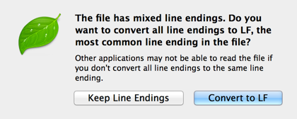

# Contributing

## Description

Modifying the XML data file directly will cause issues in pull requests because it will most likely cause line ending issues.

*This is not your fault nor the fault of the project.* 

This is because the WordPress export produces a pretty messed up export file when it comes to line endings.

That's why the best way to contribute to WP Test, in it's current form, is to use the WordPress Admin.

While not ideal, it does provide the most consistent way to recreate the test data, for now.

In the future, when WP Test hopefully becomes a plugin, it will be much easier to add / edit data.

## How To Contribute

Use the steps outlined below to contribute to the WP Test project.

1. [Fork](https://github.com/manovotny/wptest/fork) the WP Test repository, if you haven't already. Otherwise, make sure your fork is up-to-date with the latest from master.
- Start with a fresh / clean WordPress installation. Make sure you remove any default "Hello World" or example data (ie. posts, pages, comments, etc.) that comes with WordPress.
- Import the latest version of the WP Test data following these [instructions](https://github.com/manovotny/wptest/blob/master/README.md#installation).
- Use the WordPress admin to make any WP Test modifications. This goes for any kind of modification, including menus, media data (ie. image captions, alt text, etc.), post, pages, featured images, etc.
- Navigate to `Tools > Export` in the WordPress admin.
- Make sure the `All content` radio button is selected and press `Download Export File`.
- Rename the exported file to `wptest.xml`.
- Replace the existing `wptest.xml` file in your fork.
- Submit a pull request and double-check that the diff doesn't contain any unexpected changes, like special metadata from plugins or themes or unintended inline styles.
- Pat yourself on the back for being awesome and for helping others with your contribution!